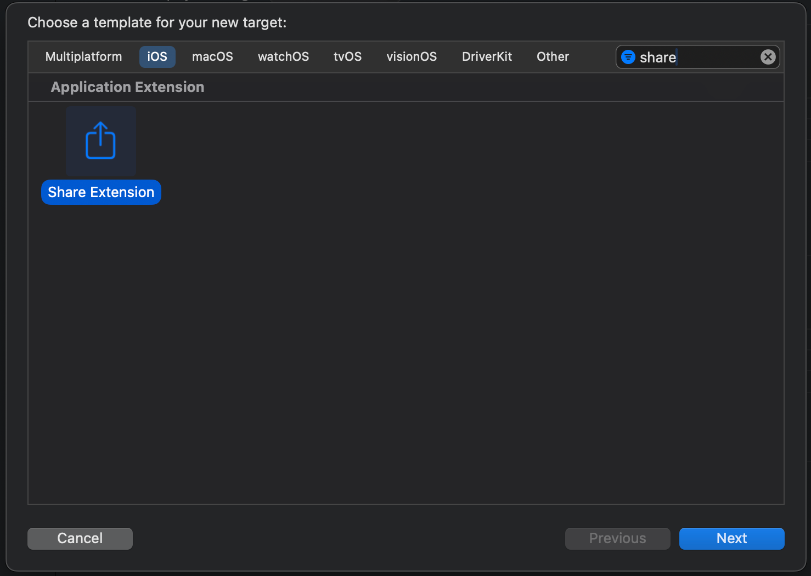
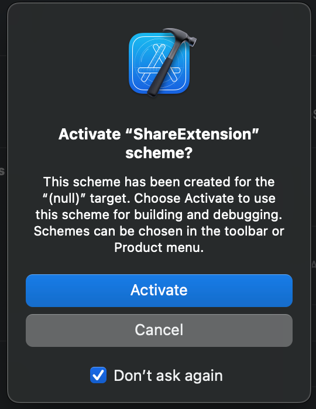
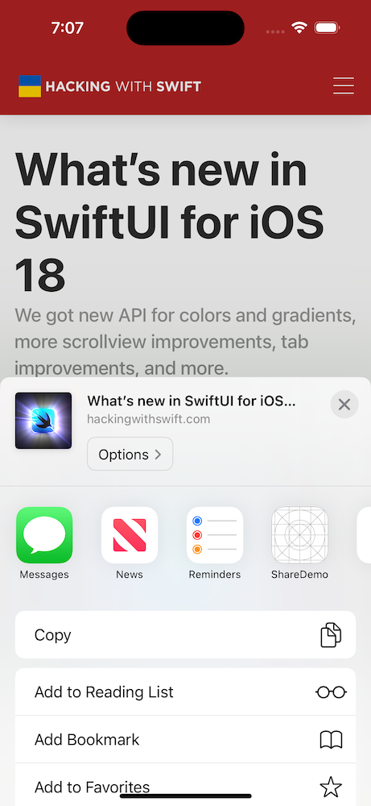
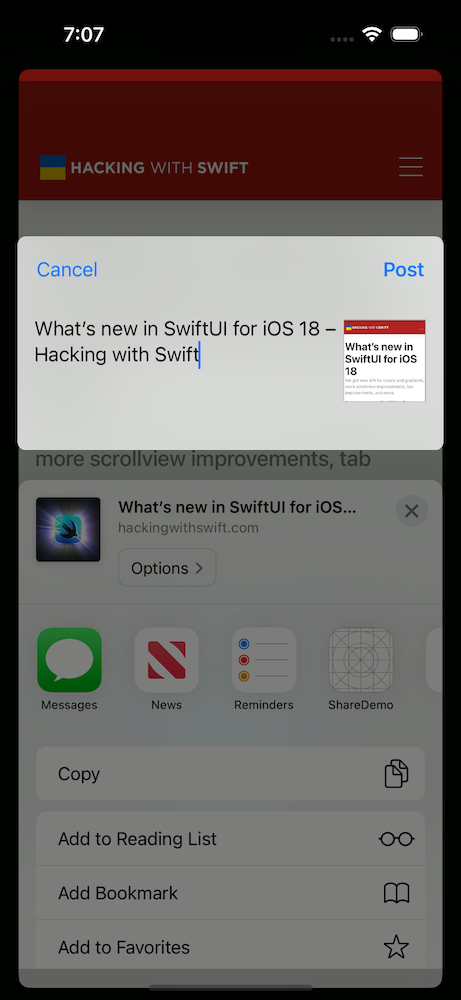

# Overview

At time of writing, the Share Extension has yet to be given the SwiftUI overhaul that other Target-types have received, so you’ll be met with a UIKit setup and Storyboard interface upon initial creation. 

If you’re like me and want to leverage SwiftUI wherever possible, this article will show you how to do just that for your Share Extensions 👇

# Share Extension Setup

The sections below will walk you through setting up a brand new Share Extension in your app. If you’ve already got one setup, feel free to jump down to SwiftUI Conversion.

## Creating a Share Extension

Following this guide requires you have a Share Extension to work from. Follow the steps below if you have yet to create one:

1. In Xcode, select File → New → Target
2. Find the `Share Extension` target and select Next



1. Provide a name for your Share Extension target
    1. If prompted, go ahead and activate the Scheme for the Share Extension



At this point you should now have a Share Extension target with the following files:

- `ShareViewController.swift` (a subclass of `SLComposeServiceViewController`)
- `MainInterface.storyboard`
- `Info.plist`

## Running the Share Extension

To see your Share Extension in action:

1. Build + Run your Share Extension scheme to a simulator
2. When prompted for an app to run in, select Safari
3. Open any webpage and tap Safari’s Share button
4. Select your app as the target for the shared content





# SwiftUI Conversion

## Removing the Storyboard Interface

To kick things off, we’ll remove the Storyboard file and update the `Info.plist` to point directly to the `ShareViewController` class as the entry point for the Share Extension:

1. Delete `MainIterface.storyboard`
2. Make the following updates to `Info.plist`:
    1. Delete the entry for `NSExtensionMainStoryboard`
    2. Add a new entry in its place with the key `NSExtensionPrincipalClass` and the value `<TargetName>.ShareViewController`
        1. Replace `<TargetName>` with the actual name of your Share Extension target
3. Build + Run your Share Extension scheme to a simulator to ensure the behavior has not changed

## Present a SwiftUI View

Now we’ll update the existing `ShareViewController` to start presenting a SwiftUI view:

1. Update `ShareViewController` to remove the inheritance of `SLComposeServiceViewController` and replace it with `UIViewController`
2. Create a SwiftUI view that will be the main interface of your Share Extension
3. Load the SwiftUI view in a `UIHostingController` and add it to your `UIViewController` on `viewDidLoad`

```swift
// MARK: - SwiftUI Interface 

struct ShareView: View {
    var body: some View {
        Text("Hello, World!")
    }
}

// MARK: - UIKit Interface

class ShareViewController: UIViewController {
    // MARK: Lifecycle

    override func viewDidLoad() {
        super.viewDidLoad()

        guard let extensionContext else {
            // Exit if we weren't provided a context to work with
            return
        }

        setupShareView(with: extensionContext)
    }

    private func setupShareView(with context: NSExtensionContext) {
		    // Wrap the SwiftUI view in a Hosting Controller
        let contentView = UIHostingController(
            rootView: ShareView()
        )
        // Add the SwiftUI view as a child of ShareViewController
        addChild(contentView)
        view.addSubview(contentView.view)

        // Pin the child view to its parent
        contentView.view.translatesAutoresizingMaskIntoConstraints = false
        NSLayoutConstraint.activate([
            contentView.view.topAnchor.constraint(equalTo: view.topAnchor),
            contentView.view.bottomAnchor.constraint(equalTo: view.bottomAnchor),
            contentView.view.leadingAnchor.constraint(equalTo: view.leadingAnchor),
            contentView.view.trailingAnchor.constraint(equalTo: view.trailingAnchor),
        ])
    }
}
```

When you build and run your Share Extension now, you should see the following when sharing a webpage.

Congrats, you’ve got SwiftUI up and running in a Share Extension! 🎉

Feel free to stop here and customize your view to fit your needs, but if you’d like to continue, I’ll walk through replicating a similar UI to that of `SLComposeServiceViewController` where we pull metadata from the URL and display it to the user. ⬇️


# Display URL Metadata in your SwiftUI Share Extension

Below I’ll walk you through the steps needed to pull metadata from a URL that was shared with your Share Extension and display it back to the user. The final result will be the following:


## App Extension Utilities

Working with `NSExtensionContext` and `NSItemProvider` can be fairly verbose, so I’ve created a couple helper extensions that we can use to extract the URL and image from the webpage shared with our Share Extension.

```swift
import Foundation
import UniformTypeIdentifiers

// MARK: - App Extension Utilities

enum ShareExtensionError: Error {
    case noAttachmentsMatchingType(UTType)
    case itemTypecastFailed(UTType)
}

extension NSExtensionContext {

		/// Attempts extracting the first attachment from the current context
		/// that matches the provided Uniform Type.
    func firstAttachment(ofType type: UTType) throws -> NSItemProvider {
        guard let firstItem = inputItems.first as? NSExtensionItem,
              let attachments = firstItem.attachments,
              let attachment = attachments.first(where: { $0.hasItemConformingToTypeIdentifier(type.identifier) }) else {
            throw ShareExtensionError.noAttachmentsMatchingType(type)
        }
        return attachment
    }
}

extension NSItemProvider {
    func loadURL() async throws -> URL {
        let uniformType = UTType.url

        let loadedItem = try await loadItem(forTypeIdentifier: uniformType.identifier)
        guard let url = loadedItem as? URL else {
            throw ShareExtensionError.itemTypecastFailed(uniformType)
        }
        return url
    }

    func loadImage() async throws -> UIImage {
        let uniformType = UTType.image

				// Make image loading async by wrapping the loadDataRepresentation(for:)
				// API with withCheckedThrowingContinuation
        return try await withCheckedThrowingContinuation { continuation in
            _ = loadDataRepresentation(for: uniformType) { imageData, error in
                if let error {
                    continuation.resume(throwing: error)
                } else if let imageData, let image = UIImage(data: imageData) {
                    continuation.resume(returning: image)
                } else {
                    continuation.resume(throwing: ShareExtensionError.itemTypecastFailed(uniformType))
                }
            }
        }
    }
}
```

## Configuring the SwiftUI View to Display Webpage Metadata

Next we’ll configure the SwiftUI view to fetch metadata from the provided URL, populate the metadata in the UI, and provide Cancel and Save actions for the user, similar to the previous `SLComposeServiceViewController`:

```swift
import LinkPresentation
import SwiftUI

// MARK: - SwiftUI Interface

struct ShareView: View {
    @State private var text: String = ""
    @State private var previewImage: Image?

    let context: NSExtensionContext

    var body: some View {
        NavigationStack {
            HStack(alignment: .top) {
		            // We'll try auto-populating the TextEditor with the webpage
		            // title, but allow the user to change that as needed.
                TextEditor(text: $text)

                if let previewImage {
                    previewImage
                        .resizable()
                        .frame(width: 80, height: 50)
                        .aspectRatio(contentMode: .fill)
                        .cornerRadius(8)
                        .shadow(radius: 10)
                }
            }
            .padding(.horizontal)
            .toolbar {
		            // Setup a navigation bar that mirrors
		            // SLComposeServiceViewController
                ToolbarItem(placement: .cancellationAction) {
                    Button("Cancel", action: cancelAction)
                }

                ToolbarItem(placement: .confirmationAction) {
                    Button("Save", action: saveAction)
                }
            }
            .task {
		            // Start loading webpage metadata before the view appears
                do {
                    try await loadWebpageMetadata(for: context)
                } catch {
                    print(error)
                }
            }
        }
    }
    
    // MARK: Button Actions

    private func cancelAction() {
        enum ShareError: Error {
            case userCancelled
        }
        context.cancelRequest(withError: ShareError.userCancelled)
    }

    private func saveAction() {
        // Return an array of results ([NSExtensionItem]) to the host app
        context.completeRequest(returningItems: [])
    }

    // MARK: Networking

    private func loadWebpageMetadata(
	    for context: NSExtensionContext
	  ) async throws {
		    // Use previously defined extensions to extract the URL
		    // from the extension context:
        let url = try await context.firstAttachment(ofType: .url).loadURL()

				// Use Apple's LPMetadataProvider API to extract metadata from the URL:
        let linkMetadataProvider = LPMetadataProvider()
        let metadata = try await linkMetadataProvider.startFetchingMetadata(for: url)

				// Once we extract the metadata, update the UI with available info
        if let webpageTitle = metadata.title {
            text = webpageTitle
        }

        if let imageProvider = metadata.imageProvider,
           let linkPreviewImage = try? await imageProvider.loadImage() {
            previewImage = Image(uiImage: linkPreviewImage)
        }
    }
}
```

The final step (which the compiler should already be complaining about) is to pass the extension context into your SwiftUI view:

```swift
class ShareViewController: UIViewController {
		
    private func setupShareView(with context: NSExtensionContext) {
        let contentView = UIHostingController(
            rootView: ShareView(context: context)
        )
        ...
    }
    
}
```

Build and Run your Share Extension again to start seeing webpage metadata populated in SwiftUI! 🚀

# Additional Resources

As you continue building our your Share Extension, check out these Apple Developer resources:

- [Apple: Share Extension Overview](https://developer.apple.com/library/archive/documentation/General/Conceptual/ExtensibilityPG/Share.html)
- [App Extension Programming Guide: Declaring Supported Data Types](https://developer.apple.com/library/archive/documentation/General/Conceptual/ExtensibilityPG/ExtensionScenarios.html#//apple_ref/doc/uid/TP40014214-CH21-SW8)